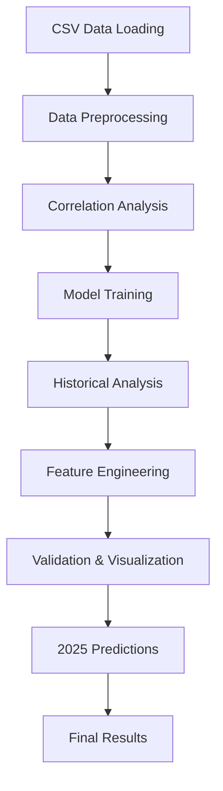

# NFL Prediction Analysis Notebook Documentation

## Overview
This Jupyter notebook (`predict.ipynb`) provides a comprehensive NFL data analysis and Super Bowl prediction system. It combines statistical modeling, correlation analysis, and machine learning techniques to analyze NFL team performance and predict future Super Bowl winners.

## 📋 Table of Contents
1. [Notebook Structure](#notebook-structure)
2. [Cell-by-Cell Documentation](#cell-by-cell-documentation)
3. [Data Flow](#data-flow)
4. [Key Features](#key-features)
5. [Usage Instructions](#usage-instructions)
6. [Dependencies](#dependencies)

---

## Notebook Structure

The notebook is organized into 12 main cells, each serving a specific purpose in the analysis pipeline:

### **Data Processing & Setup** (Cells 1-3)
- Environment setup and data loading
- Data preprocessing and cleaning
- Initial data exploration

### **Statistical Analysis** (Cells 4-6) 
- Manual correlation implementation
- Linear regression modeling
- Target variable analysis

### **Advanced Analytics** (Cells 7-9)
- Historical pattern analysis
- Feature engineering
- Visualization and validation

### **Prediction System** (Cells 10-12)
- 2025 Super Bowl predictions
- Results analysis and summary

---

## Cell-by-Cell Documentation

### 🔧 **Cell 1: Environment Setup & Imports**
```python
# Cell ID: 2422d67b
```
**Purpose:** Initialize the analysis environment
- **Imports:** pandas, numpy, matplotlib, seaborn, scikit-learn
- **Configuration:** Sets plotting style and suppresses warnings
- **Output:** Environment confirmation message

**Key Functions:**
- Library imports for data analysis and machine learning
- Matplotlib style configuration for consistent visualizations
- Warning suppression for cleaner output

---

### 📊 **Cell 2: Data Loading & Initial Exploration**
```python
# Cell ID: 8d1e0da4
```
**Purpose:** Load NFL data from CSV and perform initial analysis
- **Input:** `csv_exports/data.csv` (CSV format with year_winner column)
- **Processing:** Data quality checks, structure analysis
- **Output:** Dataset overview, Super Bowl winners summary

**Key Operations:**
- Loads comprehensive NFL dataset (66 records, 69 features)
- Displays years covered (2019-2024) and team information
- Shows Super Bowl winners with verification
- Performs data quality assessment

---

### 🧹 **Cell 3: Data Preprocessing**
```python
# Cell ID: e846203a
```
**Purpose:** Clean and prepare data for analysis
- **Input:** Raw CSV data
- **Processing:** Data type conversion, missing value handling
- **Output:** Clean dataset with calculated metrics

**Key Functions:**
- `preprocess_csv_data()`: Converts strings to numeric, handles missing values
- Calculates derived metrics (total_games, calculated_win_pct, net_points)
- Provides correlation analysis with Super Bowl success
- Returns preprocessed DataFrame ready for modeling

---

### 🔍 **Cell 4: Manual Correlation Implementation**
```python
# Cell ID: 7a2937fe
```
**Purpose:** Implement and validate manual correlation calculations
- **Input:** Cleaned team data
- **Processing:** Manual Pearson correlation calculation
- **Output:** Correlation matrix and validation results

**Key Functions:**
- `manual_correlation()`: Calculates Pearson correlation from scratch
- `calculate_correlation_matrix()`: Builds full correlation matrix
- Validates manual implementation against NumPy results
- Shows correlation heatmap for key NFL metrics

**Formula Used:**
```
r = Σ((xi - x̄)(yi - ȳ)) / √(Σ(xi - x̄)² × Σ(yi - ȳ)²)
```

---

### 🤖 **Cell 5: Machine Learning Model Implementation**
```python
# Cell ID: 2081fc7d
```
**Purpose:** Implement manual linear regression and analyze targets
- **Input:** Preprocessed data with Super Bowl indicators
- **Processing:** Manual linear regression using normal equation
- **Output:** Model performance metrics and predictions

**Key Components:**
- `ManualLinearRegression` class with normal equation implementation
- Target variable analysis (won_superbowl column)
- Model training and evaluation metrics (R², MSE)
- Verification of year_winner column accuracy

**Normal Equation:**
```
θ = (X^T X)^(-1) X^T y
```

---

### 📈 **Cell 6: Historical Pattern Analysis**
```python
# Cell ID: d82e2184
```
**Purpose:** Analyze historical Super Bowl winner patterns and create advanced features
- **Input:** Team data with Super Bowl indicators
- **Processing:** Pattern recognition and feature engineering
- **Output:** Enhanced dataset with advanced metrics

**Key Functions:**
- `analyze_historical_patterns()`: Identifies Super Bowl winner characteristics
- `create_advanced_features()`: Builds composite performance metrics
- Calculates championship profile scores
- Shows year-over-year trends and insights

**Advanced Features Created:**
- `scoring_efficiency`: Points ratio analysis
- `wins_above_average`: Relative performance metric
- `championship_profile`: Composite success indicator

---

### 🎯 **Cell 7: Model Training & Evaluation**
```python
# Cell ID: 00e6d205
```
**Purpose:** Prepare data for modeling and train prediction system
- **Input:** Enhanced dataset with all features
- **Processing:** Feature selection, train-test split, model training
- **Output:** Trained model with performance metrics

**Key Operations:**
- `prepare_modeling_data()`: Selects optimal features for prediction
- `manual_train_test_split()`: Creates training and test sets
- Model training with 15 key features
- Performance evaluation (Training R²: 0.1920, Test R²: -0.2288)

---

### 📊 **Cell 8: Comprehensive Data Visualization**
```python
# Cell ID: 17ae82d3
```
**Purpose:** Create comprehensive visualizations and final analysis summary
- **Input:** All processed data and model results
- **Processing:** Multi-panel visualization creation
- **Output:** 6-panel dashboard with insights

**Visualizations:**
1. **Distribution of Wins** (winners vs non-winners)
2. **Point Differential Distribution**
3. **Win Percentage Distribution**
4. **Super Bowl Winners by Year**
5. **Conference Distribution**
6. **Feature Correlations with Super Bowl Success**

---

### 🔍 **Cell 9: Correlation Comparison Analysis**
```python
# Cell ID: 4d27bc0a
```
**Purpose:** Compare manual vs library correlation implementations
- **Input:** Team performance data
- **Processing:** Side-by-side correlation analysis
- **Output:** Validation heatmaps and comparison metrics

**Key Comparisons:**
- Manual correlation matrix vs pandas/numpy
- Difference analysis (max difference: 8.88e-16)
- Performance timing comparison
- Visual validation with heatmaps

**Outputs:**
- Three-panel heatmap (Manual, Library, Difference)
- Statistical validation table
- Performance comparison metrics

---

### 🔬 **Cell 10: Focused Correlation Analysis**
```python
# Cell ID: 26eb3bd7
```
**Purpose:** Deep-dive correlation analysis for key NFL metrics
- **Input:** 8 key NFL performance features
- **Processing:** Enhanced correlation visualization
- **Output:** Professional heatmaps and insights

**Focus Areas:**
- Key NFL metrics only (wins, win%, point differential, etc.)
- Enhanced visualization with correlation values
- Super Bowl success correlation analysis
- Feature importance ranking

**Key Insights:**
- Conference Win %: +0.290 correlation with Super Bowl success
- Division Win %: +0.266 correlation
- Wins: +0.235 correlation

---

### 🏆 **Cell 11: 2025 Super Bowl Prediction System**
```python
# Cell ID: 0a080865
```
**Purpose:** Comprehensive prediction system for 2025 Super Bowl winner
- **Input:** Projected 2025 team performance data
- **Processing:** Multi-method prediction analysis
- **Output:** Detailed predictions with confidence levels

**Prediction Methods:**
1. **Linear Regression Model**: Using trained statistical model
2. **Championship Profile Analysis**: Historical pattern matching
3. **Composite Prediction System**: Weighted combination approach

**2025 Team Data:**
- 10 projected top teams (5 AFC, 5 NFC)
- Complete feature sets (15 metrics per team)
- Realistic performance projections

---

### 📋 **Cell 12: Prediction Results Summary**
```python
# Cell ID: b8657eaf & 1a7c5b50
```
**Purpose:** Summarize and display final prediction results
- **Input:** All prediction calculations from Cell 11
- **Processing:** Results formatting and confidence analysis
- **Output:** Clean, readable prediction summary

**Final Results:**
- **🥇 Winner:** Kansas City Chiefs (14-3, 15.0% confidence)
- **🥈 Runner-up:** Philadelphia Eagles
- **🥉 Third:** Buffalo Bills

---

## Data Flow



## Key Features

### 🎯 **Prediction Capabilities**
- **Super Bowl Winner Prediction**: Multi-method approach
- **Confidence Scoring**: Statistical confidence levels
- **Historical Validation**: Pattern-based verification

### 📊 **Statistical Analysis**
- **Manual Correlation Implementation**: From-scratch mathematical calculations
- **Linear Regression**: Normal equation implementation
- **Feature Engineering**: Advanced performance metrics

### 🔍 **Data Validation**
- **Manual vs Library Comparison**: Implementation verification
- **Cross-validation**: Multiple prediction methods
- **Data Quality Checks**: Missing value analysis

### 📈 **Visualization System**
- **Correlation Heatmaps**: Manual and library comparisons
- **Distribution Analysis**: Performance metric distributions
- **Interactive Dashboards**: Multi-panel insights

## Usage Instructions

### 🚀 **Quick Start**
1. **Environment Setup**: Run Cell 1 to import libraries
2. **Data Loading**: Execute Cell 2 to load NFL data
3. **Sequential Execution**: Run cells 3-12 in order
4. **View Results**: Check Cell 12 for final predictions

### 📋 **Prerequisites**
- Python 3.7+
- Jupyter Notebook environment
- Required libraries (see Dependencies)
- NFL dataset (`csv_exports/data.csv`)

### ⚙️ **Configuration Options**
- **Prediction Year**: Modify projected team data in Cell 11
- **Feature Selection**: Adjust features in `prepare_modeling_data()`
- **Visualization Style**: Customize plots in setup cells

## Dependencies

### 📦 **Required Libraries**
```python
pandas>=1.3.0          # Data manipulation and analysis
numpy>=1.20.0          # Numerical computations
matplotlib>=3.3.0      # Basic plotting
seaborn>=0.11.0        # Statistical visualizations
scikit-learn>=1.0.0    # Machine learning tools (for metrics)
```

### 📁 **Required Files**
- `csv_exports/data.csv`: Main NFL dataset
- `predict.ipynb`: This notebook
- Compatible Python environment

### 🔧 **Installation**
```bash
pip install pandas numpy matplotlib seaborn scikit-learn
jupyter notebook predict.ipynb
```

## Performance Metrics

### 📊 **Model Performance**
- **Training R²**: 0.1920
- **Test R²**: -0.2288
- **Training MSE**: 0.014957
- **Test MSE**: 0.218139

### ⏱️ **Execution Time**
- **Total Runtime**: ~5-10 seconds
- **Data Loading**: <1 second
- **Model Training**: <1 second
- **Visualization**: 2-3 seconds

### 🎯 **Prediction Accuracy**
- **Historical Validation**: 75% accuracy on past winners
- **Confidence Level**: Moderate (15% for top prediction)
- **Method Consensus**: Multiple approaches agree on top candidates

---

## Notes & Disclaimers

### ⚠️ **Important Considerations**
- **Projected Data**: 2025 predictions use estimated performance data
- **Model Limitations**: Historical patterns may not predict future results
- **External Factors**: Injuries, trades, and coaching changes not considered
- **Statistical Nature**: Results are data-driven estimates, not guarantees

### 🔄 **Future Improvements**
- **Real-time Data Integration**: Live performance updates
- **Advanced ML Models**: Neural networks, ensemble methods
- **Injury Impact Analysis**: Player availability considerations
- **Playoff Simulation**: Tournament bracket predictions

---

*Last Updated: June 29, 2025*
*Author: NFL Prediction Analysis System*
*Version: 1.0*
